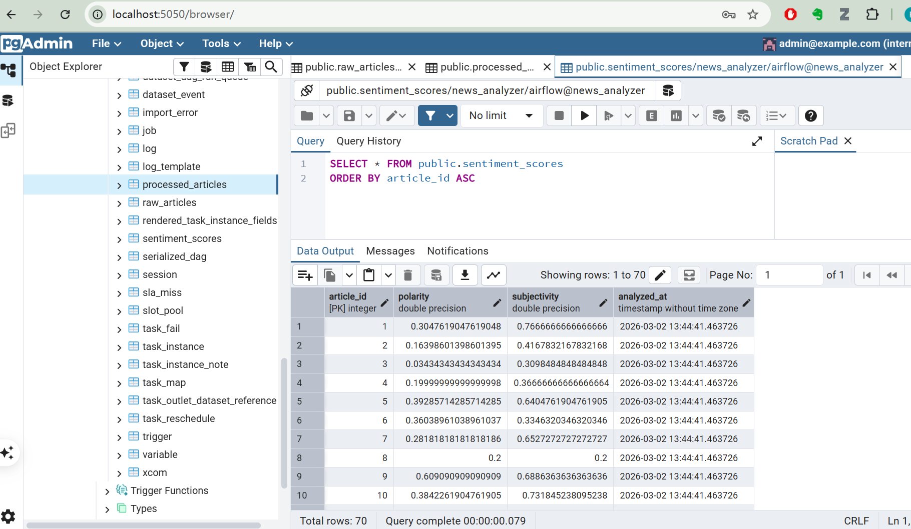
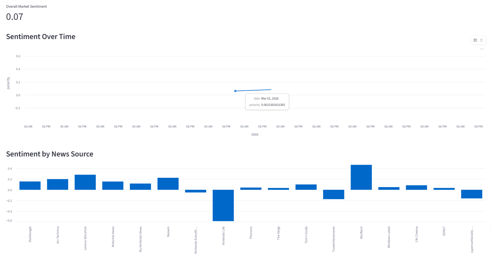
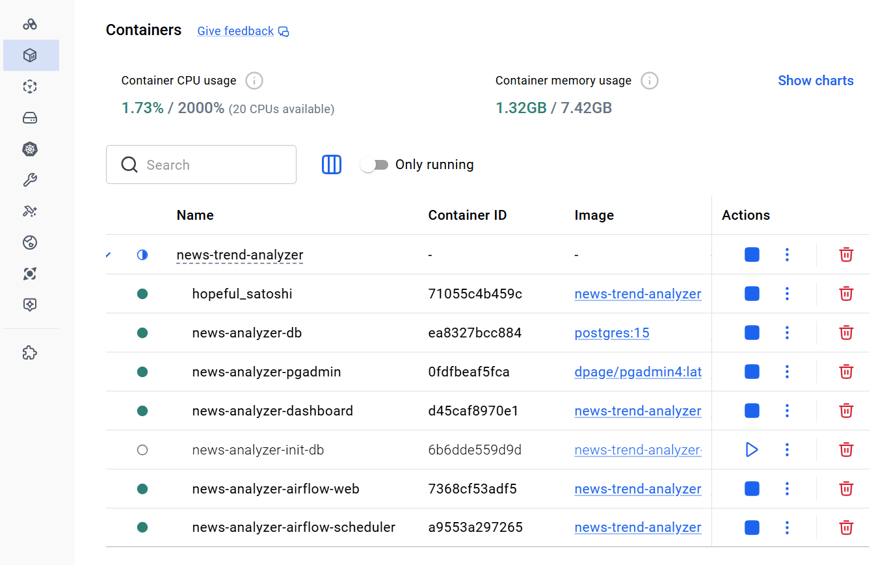
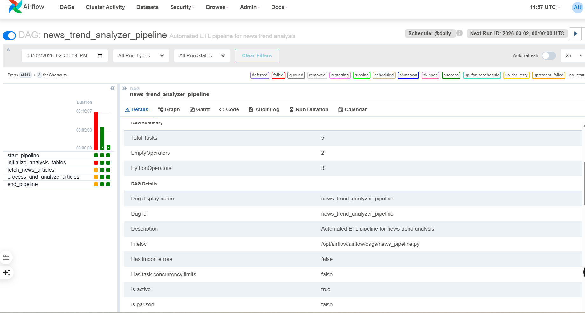

# News Trend Analyzer (Automated)
An Python-based end-to-end automated news trend analysis pipeline that:
- Collects news articles on a schedule from RSS feeds
- Processes and analyzes text sentiment and topics  
- Stores results in a database  
- Visualizes trends in a real-time dashboard
- Fully containerized using Docker

## Table of Contents
* [Tech Stack](#tech-stack)
* [Architecture](#architecture)
* [Demo Screenshots](#demo-screenshots)
* [Quick Start](#quick-start)
* [Airflow DAG Details](#airflow-dag-details)
* [Some Troubleshooting](#some-troubleshooting)
* [Useful Commands](#useful-commands)
* [Suggested Additions / Improvements](#suggested-additions--improvements)

## Tech Stack
- **Airflow** – orchestrates the ETL tasks  
- **PostgreSQL** – stores raw and processed data  
- **Python** – core logic for scraping, NLP, and DB ops  
- **Streamlit** – live dashboard for exploration
- **Docker** - wrap the program 
- **Analysis** - NLP to analyze contents (e.g., TextBlob, SnowNLP etc)
  
## Architecture


## Demo Screenshots

The News Trend Analyzer pipeline includes the following features:

| Feature                          | Description                                                                                 | Screenshot                                                                 |
| -------------------------------- | ------------------------------------------------------------------------------------------- | -------------------------------------------------------------------------- |
| **Data Storage**                 | Stores raw and processed articles in PostgreSQL, including sentiment scores                 | |
| **Real-time Dashboard**          | Visualizes trends by sentiment, news source, and time using Streamlit                       |   |
| **Containerized Environment**    | Docker ensures reproducibility and easy deployment of all components                        | |
| **Airflow ETL Orchestration**    | DAG automates initialization, data fetching, and analysis steps                             | |


## Quick Start
1. **Clone the repository**

```bash
git clone https://github.com/your-username/news-trend-analyzer.git
cd news-trend-analyzer
```

2. **Set up environment variables (optional)**

Create a `.env` file and adjust the values:

```dotenv
POSTGRES_USER=user
POSTGRES_PASSWORD=psw
POSTGRES_DB=dbname
```

3. **Build and start all services**

```bash
docker-compose up --build -d
```

4. **Access the applications**

| Service   | Default URL                                    |
| --------- | ---------------------------------------------- |
| Airflow   | [http://localhost:8080](http://localhost:8080) |
| Streamlit | [http://localhost:8501](http://localhost:8501) |
| pgAdmin   | [http://localhost:5050](http://localhost:5050) |

*Note:* Wait a minute for all services to become healthy, especially Airflow and PostgreSQL.


## Airflow DAG Details

The DAG `news_trend_analyzer_pipeline` (defined in `airflow/dags/news-pipeline.py`) consists of the following tasks:

* **initialize_analysis_tables**

  * Creates `processed_articles` and `sentiment_scores` tables if they don’t exist
  * Depends on: None (*init_db is run externally via Docker Compose*)
  * Runs before: `fetch_news_articles`

* **fetch_news_articles**

  * Fetches articles from RSS feeds and inserts into `raw_articles`
  * Depends on: `initialize_analysis_tables`
  * Runs before: `process_and_analyze_articles`

* **process_and_analyze_articles**

  * Cleans raw article text, removes duplicates, performs sentiment analysis, and stores results in `sentiment_scores`.
  * Depends on: `fetch_news_articles`

* **Start & End markers** – dummy tasks for visual clarity

The DAG runs daily (`@daily`) and can also be triggered manually via Airflow UI.


## Some Troubleshooting

* **`sqlalchemy.exc.NoSuchModuleError`**

  * Cause: Mixing psycopg (v3) and psycopg2, or SQLAlchemy version too old
  * Solution: Use `psycopg2-binary` and SQLAlchemy `<2.0` (`sqlalchemy>=1.4.36,<2.0`)

* **Airflow webserver: `database "airflow" does not exist`**

  * Cause: Airflow is trying to connect to a database named `airflow`, but my database is news_analyzer. 
  * Solution: Ensure `init_db` ran correctly that actually created the news_analyzer database successfully, plus check SQLAlchemy/psycopg2 versions that if compatible with `apache-airflow[postgres]==2.9.0`.

* **Streamlit: `Engine object has no attribute 'cursor'`**

  * Cause: Incorrect usage of SQLAlchemy engine with pd.read_sql. Pandas expects either a raw DB-API connection or an engine, but some versions may mis-handle connections.
  * Solution: Use `conn.execute()` and save queried results to a new `dataframe`.

* **Airflow: `RuntimeError: DB_PASSWORD environment variable must be set`**

  * Cause: The custom function `get_connection()` requires `DB_PASSWORD`, but the variable is not passed to Airflow containers.
  * Solution: Add `DB_PASSWORD: ${POSTGRES_PASSWORD:-xxx}` to the environment section of airflow-webserver and airflow-scheduler in docker-compose.yml.

* **`initialize_analysis_tables` fails silently**

  * Cause: Table creation SQL may have errors or lack error handling
  * Solution: Run manually inside container to see the exact error:

```bash
docker exec -it news-analyzer-airflow-web python -c "from processing.clean_and_sentiment import initialize_analysis_tables; initialize_analysis_tables()"
```

---

## Useful Commands

| Command                                                             | Description                                                   |
| ------------------------------------------------------------------- | ------------------------------------------------------------- |
| `docker-compose up --build -d`                                      | Build images and start all containers                         |
| `docker-compose ps [service]`                                       | Check status of services                                      |
| `docker-compose logs -f [service]`                                  | Follow logs of a specific service (e.g., `airflow-webserver`) |
| `docker-compose down`                                               | Stop and remove containers (data volumes persist)             |
| `docker exec -it news-analyzer-db psql -U airflow -d news_analyzer` | Open a PostgreSQL shell inside container                      |


